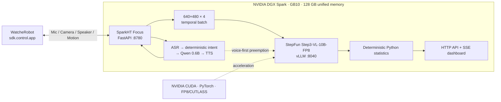

# Seeing Focus

[](https://github.com/orulink-ai/SparkHT-Focus-Demo/actions/workflows/ci.yml)
[](https://www.python.org/)
[](LICENSE)

> Give WatcheRobot low-latency Chinese conversation and continuous multimodal observation on one NVIDIA DGX Spark.

English | [简体中文](README.md)

SparkHT Focus is an independent edge-side Python orchestration service for a hackathon demo. Its fast path handles low-latency Chinese voice interaction. Its slow path analyzes periodic 640×480 robot-camera frames with StepFun's open Step3-VL-10B-FP8 model. Deterministic Python code—not the model—then aggregates presence, visible-phone, and focus-proxy metrics.

All model services, scheduling, the robot gateway, and the dashboard run locally on DGX Spark. The project is independent of `WatcheRobot_server`; one connection to the robot's `sdk.control.app` carries microphone audio, camera frames, speaker audio, facial animations, and servo actions.

## DGX Spark × NVIDIA × StepFun

Three layers make it practical to run the interactive and observational paths together on one desktop system:

| Contributor | What this project actually uses | Why it matters |
|---|---|---|
| **NVIDIA DGX Spark** | GB10 Grace Blackwell, 128 GB coherent unified memory, Arm64 DGX OS | Co-locates Step3-VL, ASR, TTS, Ollama, FastAPI, and runtime buffers without moving media between compute hosts |
| **NVIDIA software ecosystem** | CUDA 13, CUDA-enabled PyTorch, vLLM, FP8/CUTLASS kernels, with NVIDIA Container Runtime and NGC available for reproducible packaging | Makes the FP8 vision service practical locally and provides a path from a hackathon environment to a containerized deployment |
| **StepFun** | Open [Step3-VL-10B](https://huggingface.co/stepfun-ai/Step3-VL-10B), including official FP8 weights and vLLM support | Supplies the slow path's multi-image perception and Schema-constrained structured observations |
| **SparkHT Focus** | Fast/slow scheduling, voice preemption, deterministic statistics, robot state machine, API, SSE dashboard, and privacy boundaries | Turns the platform, model, and robot SDK into one testable end-to-end demo |

NVIDIA specifies [DGX Spark](https://www.nvidia.com/en-us/products/workstations/dgx-spark/) with 128 GB of coherent unified memory and up to 1 PFLOP of theoretical FP4 AI performance. This demo runs FP8 Step3-VL inference, so it does not present that FP4 figure as an application benchmark. On the measured system, the Step3 vLLM EngineCore occupied about 34.1 GiB of unified memory; about 42 GiB remained available while the four local model services and gateway were running together. DGX Spark also ships with the [NVIDIA Container Toolkit](https://docs.nvidia.com/dgx/dgx-spark/nvidia-container-runtime-for-docker.html) configured, although the current repository deliberately runs vLLM from an isolated Python environment rather than claiming a container deployment it does not yet use.

StepFun's role is specifically the slow vision system. Step3-VL emits structured facts such as `person_present`, `phone_visible`, `cup_state`, and confidence. Thresholding, temporal aggregation, session rules, and the final proxy score remain deterministic application code in this repository. The fast path currently uses local Qwen-family ASR, short-dialogue, and TTS services; those components are not attributed to StepFun.

## Highlights

- Start, query, stop, or cancel a focus session by voice.
- Run short conversations through Ollama `qwen3:0.6b` with trusted live statistics only.
- Capture one frame every 10 seconds and analyze four-frame batches with Step3-VL-10B-FP8.
- Preempt or cancel slow vision work when speech is detected.
- Show native 4:3 images, the latest four upstream/downstream messages, core metrics, health, and events in one ultrawide dashboard, with a responsive narrow-screen fallback.
- Play a focus animation and a head-up/nod/neutral gesture when a session starts, then actively maintain the focus expression from the SparkHT state machine.
- Pair the robot at runtime from the Web status card without restarting the gateway or persisting the six-digit code.
- Store sessions, events, frames, and reports locally on the Spark.

## Architecture



## Why edge-local

- Robot images and audio remain on the trusted LAN instead of taking a cloud round trip.
- One scheduler can give speech priority by pausing or cancelling slow Step3 work.
- Model versions, frame counts, timeouts, and scoring rules stay reproducible for a live demo.
- Runtime frames and session data remain local to Spark and are excluded from Git.

## Measured snapshot

These are measurements from the same DGX Spark, not theoretical peak claims. See the [performance record](docs/performance.md) for the full methodology.

| Path | Measured result |
|---|---:|
| Step3-VL, four 640×480 frames, 192 tokens | P50 9.564 s / P95 11.212 s |
| Warm ASR + Ollama + TTS component sum | P50 1.619 s / P95 1.823 s |
| Two final 90-second physical-robot runs | 9/8 valid captures, two successful vision batches each |
| Automated tests | 87 |

## Local services

| Service | Address | Purpose |
|---|---|---|
| SparkHT Focus | `0.0.0.0:8780` | Robot gateway, state machine, API, dashboard |
| Qwen ASR | `127.0.0.1:8010` | Chinese speech recognition |
| Qwen3-TTS | `127.0.0.1:8030` | Chinese speech synthesis |
| Ollama | `127.0.0.1:11434` | Short `qwen3:0.6b` replies |
| Step3 vLLM | `127.0.0.1:8040` | Structured four-image observations |

## Quick start

Python 3.12 is required. Keep the gateway and vLLM in separate virtual environments.

```bash
python3.12 -m venv .venv
.venv/bin/pip install --upgrade pip
.venv/bin/pip install --extra-index-url https://test.pypi.org/simple \
  -e '.[test,model]'
cp .env.example .env

FOCUS_ENABLE_ROBOT=false .venv/bin/focus-demo
```

Open `http://127.0.0.1:8780/` and check `http://127.0.0.1:8780/health`. Model services may appear unavailable in this gateway-only mode.

For model setup, Windows-to-Spark weight transfer, firewall rules, dual-NIC troubleshooting, and robot pairing, follow the Chinese [complete quick-start guide](docs/quickstart.md) and [configuration reference](docs/configuration.md).

## Development

Tests use fakes, spies, and HTTP mocks; they do not require a GPU, model server, or physical robot.

```bash
.venv/bin/ruff format --check src tests scripts
.venv/bin/ruff check src tests scripts
.venv/bin/pytest
```

See [CONTRIBUTING.md](CONTRIBUTING.md), [CODE_OF_CONDUCT.md](CODE_OF_CONDUCT.md), [SECURITY.md](SECURITY.md), and [CHANGELOG.md](CHANGELOG.md) before contributing.

## Privacy and scope

- The system does not perform OCR, identity recognition, emotion recognition, or infer screen/work content.
- Cup changes are reported only as possible movement or possible drinking events.
- Focus trends are low-resolution visual proxy metrics, not medical or productivity assessments.
- Runtime frames, audio, logs, pairing codes, model weights, and `.env` files are excluded from Git.

## Acknowledgements and attribution

- [NVIDIA DGX Spark](https://www.nvidia.com/en-us/products/workstations/dgx-spark/) and the CUDA, GPU-enabled PyTorch, vLLM, and FP8 ecosystem provide the compute and software foundation for local multi-model execution.
- [StepFun](https://www.stepfun.com/) open-sourced Step3-VL-10B and provides FP8 weights and vLLM integration, enabling the slow vision path within the hackathon schedule.
- [WatcheRobot Python SDK](https://github.com/orulink-ai/WatcheRobot_python_sdk) provides microphone, camera, audio, expression, and motion control over one LAN connection.
- Qwen, Ollama, FastAPI, Pydantic, and the other open-source dependencies make up the remaining local stack. Exact versions and boundaries are documented in `pyproject.toml` and the environment/configuration documents.

NVIDIA, DGX, CUDA, StepFun, Qwen, WatcheRobot, and other names and trademarks belong to their respective owners. This is an independent open-source hackathon project and does not imply vendor endorsement beyond the explicitly linked open-source components.

## License

The source code is licensed under the [Apache License 2.0](LICENSE). Models, the robot SDK, and other third-party components remain subject to their respective licenses.
