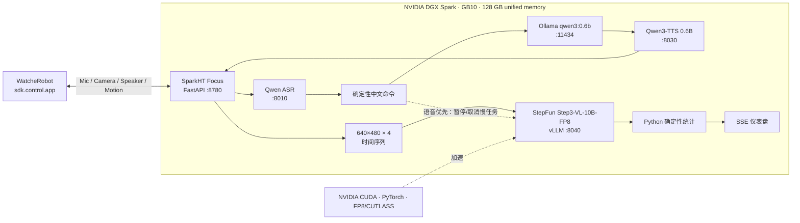

# 创造专注：WatcheRobot 多模态识别 & 专注反馈

[](https://github.com/orulink-ai/SparkHT-Focus-Demo/actions/workflows/ci.yml)
[](https://www.python.org/)
[](LICENSE)

> 让机器人帮你留住一段不被打扰的时间。

[English](README.en.md) | 简体中文

“创造专注”是 ORULINK 团队为第二届 NVIDIA DGX Spark 黑客松打造的桌面伙伴。它不是一个试图占据更多屏幕时间的聊天工具：你说一声“开始专注”，机器人就安静地陪着你；等这段时间结束，它再根据低频、多模态观察，给出克制而真诚的反馈。

项目由独立端侧 Python 服务实现。快系统负责低延迟中文语音交互；慢系统使用 StepFun 开源的 Step3-VL-10B-FP8，对机器人定时抓拍的 640×480 图片进行时间序列观察；最终由确定性 Python 代码累计在位率、手机可见率和专注趋势，而不是让大模型直接给用户打分。

全部模型服务、机器人网关、调度器和仪表盘都运行在本地 DGX Spark 上。项目不依赖 `WatcheRobot_server`；机器人只打开一个 `sdk.control.app`，同一条 Python SDK 连接承载麦克风、相机、扬声器、表情动画和舵机动作。

## 项目及报告书

| 项目 | 内容 |
|---|---|
| 参赛赛事 | 第二届 NVIDIA DGX Spark 黑客松 |
| 赛事主题 | 让 Agent 创作一切 · 多模态 Agent 创意挑战赛 |
| 参赛团队 | ORULINK 团队 |
| 项目名称 | 创造专注：多模态识别与专注反馈的桌面伙伴 |
| 项目方向 | 为你创造专注环境，并给出真诚的反馈 |
| 技术载体 | WatcheRobot 具身终端 + SparkHT 独立编排服务 + NVIDIA DGX Spark 本地模型服务 |

## 我们想做的事

这一届黑客松的主题是“让 Agent 创作一切”。我们没有先去想怎样让 AI 写更多文章、画更多图，而是想回答一个更贴近日常的问题：**能不能让桌面上的机器人，帮你创造一段真正专注的时间？**

专注越来越难。手机一亮、消息一响，注意力就被拉走；而许多专注工具本身也住在屏幕里——你要打开 App、盯着倒计时，反而一次次被拉回屏幕。

我们想换一个思路：把这件事交给一个“在桌面上”的伙伴。它不占用你的屏幕，也不要求你一直看着它。你专注你的，它安静陪伴、低频观察；当你主动询问或会话结束时，它才给出反馈。**陪你进入专注，再帮你看见自己的专注，这两件事合在一起，才叫“创造专注”。**

## DGX Spark × NVIDIA × StepFun

这个 Demo 能在单台桌面设备上同时运行快语音链路和 10B 视觉语言模型，离不开三层能力的配合：

| 贡献方 | 本项目实际使用的能力 | 带来的价值 |
|---|---|---|
| **NVIDIA DGX Spark** | GB10 Grace Blackwell、128 GB 一致性统一内存、Arm64 DGX OS | 在一台紧凑设备上同时容纳 Step3-VL 推理引擎、ASR、TTS、Ollama、FastAPI 和运行缓存，省去跨机器传输图片与音频的复杂度 |
| **NVIDIA 软件生态** | CUDA 13、PyTorch CUDA、vLLM、FP8/CUTLASS 内核，以及可用的 NVIDIA Container Runtime/NGC 工具链 | 让 Step3-VL-FP8 能以本地 OpenAI 兼容服务运行，并为可复现的 GPU 环境与后续容器化提供基础 |
| **StepFun（阶跃星辰）** | 开源 [Step3-VL-10B](https://huggingface.co/stepfun-ai/Step3-VL-10B) 及其官方 FP8、vLLM 支持 | 提供慢系统的多图视觉感知与结构化观察能力，使 640×480 时间序列可以转换为受 Schema 约束的事实记录 |
| **SparkHT Focus（本仓库）** | 快慢调度、语音优先抢占、确定性统计、机器人状态机、API、SSE 仪表盘和隐私边界 | 把硬件、模型与机器人 SDK 组合成一条可以现场运行、测试和复盘的完整 Demo 链路 |

[DGX Spark 官方规格](https://www.nvidia.com/en-us/products/workstations/dgx-spark/)给出 128 GB 一致性统一内存和最高 1 PFLOP FP4 理论 AI 算力；本项目实际运行的是 Step3-VL FP8 推理，二者不是同一精度口径。实测中，Step3 vLLM EngineCore 约占 34.1 GiB 统一内存，四个本地模型服务与网关同时运行时仍保留约 42 GiB 可用内存。DGX Spark 官方软件栈还预装并配置了 [NVIDIA Container Toolkit](https://docs.nvidia.com/dgx/dgx-spark/nvidia-container-runtime-for-docker.html)，但本仓库当前使用隔离 Python 环境启动 vLLM，没有把“可用的生态能力”包装成“已经采用的容器部署”。

StepFun 的贡献集中在慢视觉系统：Step3-VL 负责逐帧输出 `person_present`、`phone_visible`、`cup_state` 和置信度等结构化观察；会话规则、阈值过滤、跨帧累计和最终趋势分数仍由本仓库的 Python 代码确定。快系统的 ASR、短对话和 TTS 当前来自 Qwen 系列本地服务，README 不将它们归因于 StepFun。

## 解决方案

系统采用“WatcheRobot 具身终端 + SparkHT 独立编排服务 + DGX Spark 本地模型服务”的三层架构，不修改现有 ESP32/STM32 固件，也不让机器人分别直连多个模型服务。

| 层级 | 核心组件 | 主要职责 | 输出 |
|---|---|---|---|
| 具身交互层 | WatcheRobot Python SDK | 麦克风采集、640×480 抓拍、音频播放、灯光、表情和动作 | 带时间戳的音频、图片与具身反馈 |
| 快系统 | Qwen ASR、Ollama `qwen3:0.6b`、Qwen3-TTS 0.6B | 中文识别、确定性命令匹配、短对话和语音回复 | 不超过 60 个中文字的即时反馈 |
| 慢系统 | Step3-VL-10B-FP8 + vLLM | 按时间理解最近四帧，观察人员、明显手机和杯子状态 | 受 JSON Schema 约束的逐帧事实 |
| 统计展示层 | SparkHT FastAPI + Web Dashboard | 快慢调度、确定性聚合、会话状态、失败降级和报告 | 专注趋势、事件记录与语音摘要 |

Demo 模式默认运行 90 秒，每 10 秒抓拍一张图片，每四张组成一个视觉批次；普通模式默认运行 25 分钟并每 30 秒抓拍，可通过环境变量调整。检测到用户说话时，系统暂停提交新的 Step3-VL 请求，并取消或延后未完成的慢任务，在语音链路空闲后只恢复最新批次。

### 已实现的 Demo 能力

- 中文语音开始、查询、停止或取消专注会话。
- 普通对话使用 Ollama `qwen3:0.6b`，并只注入可信的实时专注统计。
- 每 10 秒抓拍一张图片，每四帧调用一次 Step3-VL-10B-FP8。
- 语音优先：检测到有效语音后暂停或取消慢视觉请求，空闲后只恢复最新批次。
- 带鱼屏横向仪表盘在一屏展示原始 4:3 图片、最近四条上下行对话、核心指标、健康状态和事件时间线，并为窄屏提供响应式回退。
- 开始专注时播放专注表情并执行“抬头 → 点头 → 回中立”，随后由 SparkHT 状态机主动维持专注表情。
- 可在 Web 技术状态卡片输入临时六位码，无需重启网关即可热配对机器人。
- 会话、事件、抓拍和报告只保存在 Spark 本地。

## 典型应用场景

### 1. 语音启动专注会话

用户说“开始九十秒专注统计”。Qwen ASR 将音频转成文本，开始、停止、取消和查询指令先经过确定性中文关键词匹配，普通对话才交给轻量 LLM。机器人回复“好的，已开始专注统计”，播放专注表情并完成“抬头 → 点头 → 回中立”动作，同时在仪表盘创建会话。

### 2. 累计式多模态观察

会话期间，机器人低频抓拍桌面场景。Step3-VL 按顺序分析多帧图片，只判断人员是否在场、明显手机是否可见、杯子是否可见及位置是否变化。SparkHT 使用确定性代码累计在位率、手机可见率、手机状态变化和疑似杯子移动事件，不让语言模型自由计算指标。

### 3. 低打扰反馈与最终总结

慢系统运行时，用户仍可询问“现在统计到哪了”，机器人优先回答已采集帧数和当前状态。会话结束后，系统生成网页报告并播报简短摘要。杯子变化只表述为“疑似杯子移动事件”，不宣称已经确认用户喝水。

## 架构



## 关键技术设计

### 统一 Python SDK 网关

机器人 App Runtime 同时只运行一个前台应用。SparkHT 中的统一网关独占机器人连接，在同一会话内处理麦克风、相机、PCM 回放、灯光、表情和舵机动作，并统一维护语音状态、抓拍计划与服务健康度，从根本上避免语音和视觉链路争夺机器人前台应用。

### 快系统：语音优先

当前交付版固定调用 `127.0.0.1:8010` 的 Qwen ASR；Paraformer 是早期方案中评估过的候选，并未伪装成当前自动回退能力。识别文本先进入确定性命令匹配，普通对话再交给 Ollama `qwen3:0.6b`。回复限制在 60 个中文字内，由 `127.0.0.1:8030` 的 Qwen3-TTS 0.6B 生成。TTS 服务提供 PCM 数据，但由于 WatcheRobot SDK v1 要求播放前声明总字节数和 SHA，网关会先缓冲短回复，再作为一个连续音频流交给机器人。

### 慢系统：StepFun 多模态理解

`stepfun-ai/Step3-VL-10B-FP8` 通过 vLLM 在 `127.0.0.1:8040` 提供 OpenAI-compatible 接口。当前服务单并发、每次最多四张图片、最大上下文 4096、最大输出 192 tokens，并使用无长思维链模板；本 Demo 不启用 PaCoRe。模型只返回逐帧结构化 JSON，低于置信度阈值或看不清的字段记为 `uncertain`，解析失败最多进行一次格式修复。BF16 Transformers 被保留为人工部署预案，不是运行时自动切换，也不会替换成非 StepFun 视觉模型。

### 快慢调度与确定性统计

系统优先级依次为用户语音、ASR/LLM/TTS、相机抓拍、Step3-VL 推理和历史持久化。慢任务保持单并发、等待队列深度为一；发生积压时丢弃旧批次，只保留最新批次。专注趋势由 Python 计算：

```text
100 × (0.7 × 在位率 + 0.3 × (1 - 手机可见率))
```

该结果明确标注为低分辨率视觉代理指标，不用于医学、教育、人事或生产力评价。

### 本地隐私与数据生命周期

原始图片、事件和报告保存在 `runtime/focus/`，Demo 默认不持久化原始麦克风音频。每个会话最多保留 100 张图片；服务启动及会话完成时会清理超过 24 小时的会话目录。模型权重、运行数据、日志、配对码和 `.env` 均被 Git 忽略。

## 为什么坚持端侧运行

- **更短的数据路径**：机器人图片和音频只在局域网与 Spark 之间流动，不必先上传云端再等待返回。
- **统一资源调度**：当用户说话时，网关可以取消或暂停 Step3 请求，把交互优先级交还给 ASR/TTS。
- **现场可控**：模型版本、端口、超时、帧数和统计规则都被固定并记录，适合黑客松演示和复盘。
- **隐私边界清楚**：运行图片与会话记录默认只保存在 Spark 本地，并被 Git 忽略。

## 实测快照

以下数据来自同一台 DGX Spark 的真实本地服务，不以理论峰值代替实测；完整口径见[性能记录](docs/performance.md)。

| 路径 | 当前实测 |
|---|---:|
| Step3-VL 四张 640×480 图片，192 tokens | P50 9.564 s / P95 11.212 s |
| 暖态 ASR + Ollama + TTS 组成项之和 | P50 1.619 s / P95 1.823 s |
| 最终两轮 90 秒真机流程 | 9/8 次有效抓拍，各 2 个成功视觉批次 |
| GitHub 自动测试 | 87 项 |

## 本地服务

| 服务 | 默认地址 | 用途 |
|---|---|---|
| SparkHT Focus | `0.0.0.0:8780` | SDK 网关、状态机、API、仪表盘 |
| Qwen ASR | `127.0.0.1:8010` | 16 kHz PCM 中文识别 |
| Qwen3-TTS | `127.0.0.1:8030` | 24 kHz PCM 中文语音合成 |
| Ollama | `127.0.0.1:11434` | `qwen3:0.6b` 短回复 |
| Step3 vLLM | `127.0.0.1:8040` | 四图结构化视觉观察 |

## 快速开始

完整的首次安装、服务检查、机器人网络配置和故障排查见
[快速开始指南](docs/quickstart.md)；所有环境变量见
[配置参考](docs/configuration.md)。下面给出最短的网关启动路径。

### 1. 安装网关

要求 Python 3.12。模型服务使用各自的隔离环境，不要安装进网关环境。

```bash
python3.12 -m venv .venv
.venv/bin/pip install --upgrade pip
.venv/bin/pip install --extra-index-url https://test.pypi.org/simple \
  -e '.[test,model]'
cp .env.example .env
```

不连接机器人、只验证 HTTP 层：

```bash
FOCUS_ENABLE_ROBOT=false .venv/bin/focus-demo
```

### 2. 启动 Step3-VL

```bash
python3.12 -m venv .vllm-venv
.vllm-venv/bin/pip install 'vllm==0.22.0' 'transformers==4.57.6'

HF_XET_HIGH_PERFORMANCE=1 .venv/bin/hf download \
  stepfun-ai/Step3-VL-10B-FP8 \
  --local-dir .models/Step3-VL-10B-FP8 \
  --max-workers 4

scripts/verify_step3_model.sh
scripts/start_step3_vllm.sh
```

`verify_step3_model.sh` 会校验运行文件和五个权重分片的 SHA-256，避免加载局域网传输不完整的模型。

### 3. 连接机器人

打开机器人上的 `sdk.control.app`，再打开仪表盘，在“技术状态 → 机器人 SDK 配对”中输入临时六位码。配对码只在当前进程内存使用，输入框提交后立即清空，无需重启网关。

无浏览器部署也可以通过无回显终端在首次启动时注入。不要把真实配对码写入 `.env`、命令历史、日志或文档。

```bash
read -r -s -p 'Pairing code: ' watcher_pairing_code
printf '\n'
WATCHER_PAIRING_CODE="$watcher_pairing_code" .venv/bin/focus-demo
unset watcher_pairing_code
```

打开 `http://<Spark-IP>:8780/`。指定会话可使用 `/?session=<session_id>`。

### 4. 创建 Demo 会话

```bash
curl -X POST http://127.0.0.1:8780/api/focus/sessions \
  -H 'Content-Type: application/json' \
  -d '{"mode":"demo","duration_seconds":90}'
```

也可以靠近机器人说“开始专注”“现在统计到哪了”“停止专注”。

## VAD 与机器人状态

- 非专注状态默认阈值：`FOCUS_VAD_IDLE_THRESHOLD=1000`。
- 专注状态默认阈值：`FOCUS_VAD_THRESHOLD=2500`。
- 连续语音达到最小确认块数后才切换 `listening` 表情，单次短噪声不会抢占当前表情。
- 专注运行中，语音结束恢复 `concentration`；最终统计中恢复 `processing`；会话真正结束后才回到待机。

当前使用能量 VAD，不是关键词唤醒。持续且足够响亮的背景谈话仍可能被识别为有效语音，录制现场应让用户靠近机器人说话并控制环境音量。

## 常用 API

| 方法 | 路径 | 说明 |
|---|---|---|
| `POST` | `/api/focus/sessions` | 创建或复用活动会话 |
| `POST` | `/api/focus/sessions/{id}/stop` | 停止并生成报告 |
| `POST` | `/api/focus/sessions/{id}/cancel` | 取消且不评分 |
| `GET` | `/api/focus/active` | 当前活动会话 |
| `GET` | `/api/focus/recent` | 最近一次会话 |
| `GET` | `/api/focus/sessions/{id}` | 会话状态与累计统计 |
| `GET` | `/api/focus/sessions/{id}/report` | 最终报告 |
| `GET` | `/api/focus/sessions/{id}/events` | SSE 事件流 |
| `GET` | `/api/focus/sessions/{id}/history` | 持久化事件历史 |
| `POST` | `/api/robot/pair` | 内存热配对机器人；供同源 Web UI 使用 |
| `GET` | `/health` | SDK 与四个模型服务健康状态 |

## 项目结构

```text
SparkHT/
├── src/focus/             # 领域模型、状态机、调度、API 与基础设施适配器
├── tests/focus/           # 单元、协议、集成与回归测试
├── scripts/               # 启动、基准、验模、视频与交付脚本
├── docs/                  # 架构报告、性能、环境、实施和录制说明
├── runtime/focus/         # 本地会话数据（Git 忽略）
├── .models/               # 本地模型权重（Git 忽略）
├── .env.example           # 无敏感信息的配置模板
└── pyproject.toml         # Python 包与质量工具配置
```

## 测试与格式

测试默认使用 fake/spy 和 HTTP mock，不需要 GPU、模型或机器人。

```bash
.venv/bin/ruff format --check src tests scripts
.venv/bin/ruff check src tests scripts
.venv/bin/pytest
```

当前交付基线为 87 项自动测试。贡献规范见 [CONTRIBUTING.md](CONTRIBUTING.md)。

真实链路基准：

```bash
.venv/bin/python scripts/benchmark_fast_chain.py
.venv/bin/python scripts/benchmark_step3_vlm.py --runs 3 frame-1.jpg frame-2.jpg
.venv/bin/python scripts/smoke_watcher_sdk.py
```

## 文档

- [快速开始](docs/quickstart.md)：从空环境到仪表盘、模型服务和机器人联调。
- [配置参考](docs/configuration.md)：环境变量、端口、防火墙与双网卡注意事项。
- [项目报告](docs/project-report.md)：设计选择、统计边界、失败案例与结果。
- [真实性能记录](docs/performance.md)：模型、相机、语音和端到端实测。
- [环境快照](docs/environment-snapshot.md)：DGX Spark、服务与资源切换记录。
- [实施与复盘手册](docs/implementation-plan.md)：12 小时计划、协议和验收清单。
- [五分钟 Demo 录制说明](docs/demo-video.md)：自动草稿、人工镜头和最终检查。
- [文档索引](docs/README.md)：各文档的读者和维护原则。

## 生成演示与交付包

从一轮真实会话生成本地旁白视频草稿：

```bash
.venv/bin/python scripts/render_demo_video.py runtime/focus/<session-id>
```

生成只包含 Git 已跟踪源码、测试和文档的提交包：

```bash
scripts/package_release.sh
```

输出位于 `dist/`，同时生成 SHA-256 文件。模型权重、虚拟环境、运行图片、音频、日志、配对码和 `.env` 不会进入压缩包。

## 边界与已知限制

- 不做 OCR、身份识别、情绪识别、屏幕内容或工作内容判断。
- 杯子变化只称为“疑似杯子移动/疑似饮水事件”，不声称确认喝水。
- 专注趋势是低分辨率视觉代理指标，仅供参考。
- 相机 P95 尚未达到 0.7 秒目标；完整异常样本保留在性能报告中。
- Python SDK v1 要求播放前提供总字节数与 SHA，因此网关会先缓冲短 TTS 回复，再作为一个连续 PCM 流提交给机器人。

## 参与贡献

欢迎通过 Issue 报告可复现的问题，或通过 Pull Request 提交小而清晰的改动。开始前请阅读
[贡献指南](CONTRIBUTING.md)、[行为准则](CODE_OF_CONDUCT.md)和
[安全政策](SECURITY.md)。项目变更记录见 [CHANGELOG.md](CHANGELOG.md)。

## 致谢与归属

- 感谢 [NVIDIA DGX Spark](https://www.nvidia.com/en-us/products/workstations/dgx-spark/) 及 CUDA、PyTorch GPU 运行时、vLLM/FP8 相关生态，为单机端侧多模型共存提供算力和软件基础。
- 感谢 [StepFun（阶跃星辰）](https://www.stepfun.com/) 开源 Step3-VL-10B，并提供 FP8 权重与 vLLM 集成，使本项目能够在有限时间内完成慢视觉系统。
- 感谢 [WatcheRobot Python SDK](https://github.com/orulink-ai/WatcheRobot_python_sdk) 提供同一局域网连接上的麦克风、相机、音频、表情与动作控制能力。
- 感谢 Qwen、Ollama、FastAPI、Pydantic 及其他开源项目。具体版本与运行边界以 `pyproject.toml`、配置参考和环境快照为准。

NVIDIA、DGX、CUDA、StepFun、Qwen、WatcheRobot 及其他名称和商标归各自权利人所有。本仓库是独立黑客松开源项目，除明确链接的开源组件外，不代表相关厂商对本项目作出官方背书。

## 许可证

本项目采用 [Apache License 2.0](LICENSE)。模型、机器人 SDK 及其他第三方组件分别受其自身许可证约束。
