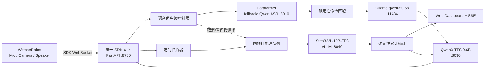

# StepFun 多模态专注统计 Demo：实施与复盘手册

> 文档状态：实现完成，保留实施决策与复盘依据
>
> 目标周期：12 小时极限黑客松
>
> Demo 形式：5 分钟录制视频，不要求现场演示
>
> 目标硬件：单台 NVIDIA DGX Spark 128GB + WatcheRobot 机器人
>
> 核心模型：阶跃星辰 `stepfun-ai/Step3-VL-10B-FP8`

## 1. 执行摘要

本项目实现一个“实时语音交互 + 非实时视觉专注统计”的机器人 Demo：

- 快系统负责中文语音理解、短回复和机器人语音播报，目标是用户说完后 4 秒内开口。
- 慢系统定时抓取 640×480 图片，每四帧调用一次 Step3-VL，累计统计人员在位、手机可见和杯子移动等低分辨率下可观察的信号。
- 慢系统不实时评价或打断用户，只更新网页仪表盘，并在会话结束时通过 TTS 播报一次总结。
- 机器人只维持一条 Python SDK 连接；Spark 上的统一网关同时承载麦克风、相机和扬声器数据。
- 不做 OCR、身份识别、情绪识别，也不把杯子移动描述成已确认的“喝水”。

最终演示名称统一使用：**看见专注：基于 StepFun 多模态模型的端侧快慢双系统机器人**。

## 2. 已确认条件与不可突破的边界

### 2.1 硬件与链路

- 摄像头最高分辨率为 640×480，无法稳定读取纸张、屏幕或书本上的文字。
- 640×480 暖机后单次抓拍中位延迟约 473.8 ms，P95 约 555.1 ms。
- 首次冷启动抓拍约 2060 ms，主要来自固件初始化和两帧预热。
- 640×480 连续单张抓拍吞吐约 2.05 张/秒，但本项目不把它当视频流使用。
- Python SDK 已支持麦克风 PCM 上行、相机 JPEG 抓拍和音频流下行。

### 2.2 固件应用互斥

WatcheRobot 固件的 App Runtime 同时只有一个前台应用。打开 `sdk.control.app` 会关闭当前语音应用，因此以下结构不可用：

```text
机器人语音应用 -> 8776
机器人 SDK 应用 -> 慢视觉服务
```

两条连接不能作为独立前台应用同时工作。必须采用：

```text
机器人 sdk.control.app
        |
        v
Spark 统一 SDK 网关
        |-- 快语音系统
        `-- 慢视觉系统
```

除非统一 SDK 网关验证失败，否则禁止在 12 小时 Demo 阶段修改 ESP32 或 STM32 固件。

### 2.3 当前 Spark 服务

实施前记录实际进程、端口、模型和显存/统一内存占用，不能只按以下清单假设：

| 服务 | 地址 | 当前用途 |
|---|---|---|
| 实时语音服务 A | `0.0.0.0:8775` | Paraformer / Qwen ASR + Qwen3-4B + Qwen TTS |
| 实时语音服务 B | `0.0.0.0:8776` | Parakeet TDT + Ollama qwen3:0.6b |
| vLLM | `127.0.0.1:8000` | Qwen3-4B |
| Qwen ASR | `127.0.0.1:8010` | ASR 备用端点 |
| Qwen TTS | `127.0.0.1:8030` | TTS 主端点 |
| Ollama | `127.0.0.1:11434` | `qwen3:0.6b` |

Parakeet TDT 的常见官方版本不覆盖中文，因此中文 Demo 不把当前 8776 的 Parakeet 作为默认 STT。优先复用服务 A 中已经跑通的 Paraformer；如果 20 分钟内无法提取可调用接口，则直接切换到 8010 的 Qwen ASR，不继续排查。

## 3. 目标架构



### 3.1 进程职责

1. **Step3-VL 服务 `:8040`**：只负责多图视觉推理，保持单并发。
2. **Focus Orchestrator `:8780`**：SDK 网关、快慢调度、统计、API、仪表盘和会话持久化。
3. **现有模型服务**：提供 ASR、Ollama 和 TTS，不复制加载相同模型。
4. **机器人**：运行 Python SDK 前台应用，不再直接连接 8775/8776。

### 3.2 资源优先级

优先级从高到低：

1. 用户语音输入与 VAD。
2. ASR、短文本生成、TTS 首段音频。
3. 相机抓拍。
4. Step3-VL 批量推理。
5. 报告持久化和仪表盘历史数据。

GPU 无法可靠地在模型进程之间进行硬抢占，因此必须在应用层控制 Step3 请求准入。检测到用户开始说话后：

- 立即停止提交新的视觉请求。
- 若当前 Step3 请求尚未完成，取消客户端任务并关闭 HTTP 流。
- 将该批次标记为 `paused_by_voice`，保留原始图片。
- 语音链路空闲连续 5 秒后最多重试一次。
- 队列中始终只保留最新的一个待分析批次。

## 4. 模型部署配置

### 4.1 Step3-VL 主配置

主模型：`stepfun-ai/Step3-VL-10B-FP8`。

建议在独立 Python 环境中启动，不为本次 Demo 引入 Docker。模型下载必须在第 0 小时立即开始，下载过程与 SDK 开发并行。

参考启动命令：

```bash
vllm serve stepfun-ai/Step3-VL-10B-FP8 \
  --served-model-name step3-vl-focus \
  --host 127.0.0.1 \
  --port 8040 \
  --trust-remote-code \
  --dtype auto \
  --max-model-len 4096 \
  --max-num-seqs 1 \
  --limit-mm-per-prompt '{"image":4}' \
  --gpu-memory-utilization 0.30
```

启动后必须先验证：

```bash
curl http://127.0.0.1:8040/v1/models
```

然后依次完成：

1. 单张 640×480 图片、64 tokens 输出。
2. 四张 640×480 图片、192 tokens 输出。
3. 连续调用三次并记录 P50/P95。
4. 在视觉调用过程中执行一次 ASR + TTS，确认快链路时延。

### 4.2 Step3-VL 回退规则

以下任一条件满足就切换到 BF16 Transformers，不继续消耗排障时间：

- 从开始配置算起 60 分钟仍无法完成单图推理。
- FP8 算子在 Spark ARM64/CUDA 环境不可用。
- vLLM 启动成功但三次调用中两次 OOM 或进程退出。

回退仍必须使用 `stepfun-ai/Step3-VL-10B`，在 `:8040` 外包一层相同的 OpenAI-compatible `/v1/chat/completions` 接口。禁止为了省时间替换成非阶跃视觉模型。

### 4.3 推理约束

- 一次最多四张图，按时间顺序排列并附带 `frame_id` 和时间戳。
- `temperature=0`，`max_tokens=192`。
- 不启用 PaCoRe，不要求长思维链。
- 请求超时 30 秒。
- JSON 校验失败只允许一次纠错重试，重试提示不重新上传更多图片。
- 单批总失败后记录 `analysis_failed`，不能阻塞后续批次或最终报告。

### 4.4 快语音配置

当前链路：

```text
SDK PCM -> VAD -> Qwen ASR :8010 -> 命令匹配/qwen3:0.6b -> Qwen3-TTS :8030
```

要求：

- LLM 回复不超过 60 个中文字。
- TTS HTTP 响应按块读取；由于 Python SDK 协议 v1 在播放前要求总字节数与 SHA，短回复会先在内存中合并，再作为一个连续 PCM 流提交，避免分片间隙。
- TTS 播放时暂停上行 ASR，检测到物理按键或明确打断事件时终止播放。
- LLM 不负责计算专注指标，只负责普通对话和把统计结果改写成一句自然语言。
- 若 Ollama 不可用，开始、结束和状态查询使用固定中文模板，整个 Demo 仍应可完成。

## 5. 服务端代码组织

所有业务实现均位于独立 `SparkHT` 项目，`WatcheRobot_server` 不参与运行。当前垂直模块如下：

```text
src/focus/
  __init__.py
  models.py                 # Pydantic 数据模型和枚举
  ports.py                  # SDK/VLM/ASR/LLM/TTS 抽象接口
  service.py                # 会话用例和状态机
  scheduler.py              # 采样、批处理、语音优先级
  aggregator.py             # 确定性统计
  prompts.py                # Step3 提示词和 JSON 纠错提示
  api.py                    # FastAPI 路由与 SSE
  runtime.py                # 启停与依赖装配
  infrastructure/
    watcher_sdk.py          # 已完成 Python SDK 的薄适配层
    stepfun_vlm.py          # OpenAI-compatible 多图请求
    asr.py                  # Paraformer/Qwen ASR 适配
    ollama.py               # qwen3:0.6b 适配
    qwen_tts.py             # 流式 TTS 适配
    session_store.py        # 文件型会话存储

scripts/run_focus_demo.py   # 独立启动入口
tests/focus/                # 单元、契约和集成测试
```

本次 Demo 作为独立服务启动，降低对现有机器人服务的回归风险。模型与 SDK 通过 `ports.py` 适配，业务层不引用具体模型 SDK。

## 6. 领域模型与状态机

### 6.1 会话状态

```text
IDLE
  -> STARTING
  -> RUNNING
  -> FINALIZING
  -> COMPLETED

任意非终态 -> FAILED
RUNNING -> CANCELLED
```

状态约束：

- 同一机器人最多一个活动专注会话。
- 重复开始命令返回当前会话，不创建第二个会话。
- `stop` 必须幂等。
- `FINALIZING` 最多等待当前批次 30 秒，超时后使用已有成功结果生成报告。
- 服务重启后，未完成会话标记为 `interrupted`，不自动恢复相机采样。

### 6.2 核心数据结构

```python
class FocusMode(str, Enum):
    DEMO = "demo"
    NORMAL = "normal"

class VisualState(str, Enum):
    PRESENT = "present"
    ABSENT = "absent"
    VISIBLE = "visible"
    NOT_VISIBLE = "not_visible"
    STABLE = "stable"
    CHANGED = "changed"
    UNCERTAIN = "uncertain"

class FocusSessionCreate(BaseModel):
    mode: FocusMode = FocusMode.DEMO
    duration_seconds: int = 90

class FrameObservation(BaseModel):
    frame_id: str
    captured_at: datetime
    person: Literal["present", "absent", "uncertain"]
    phone: Literal["visible", "not_visible", "uncertain"]
    cup: Literal["visible", "not_visible", "uncertain"]
    cup_motion: Literal["stable", "changed", "uncertain"]
    confidence: float = Field(ge=0, le=1)
    evidence: str = Field(max_length=30)

class BatchAnalysis(BaseModel):
    batch_id: str
    observations: list[FrameObservation]
    model_name: str
    latency_ms: int
    status: Literal[
        "completed", "paused_by_voice", "analysis_failed", "dropped_as_stale"
    ]

class FocusReport(BaseModel):
    session_id: str
    started_at: datetime
    ended_at: datetime
    captured_frames: int
    analyzed_frames: int
    failed_frames: int
    presence_ratio: float | None
    phone_visible_ratio: float | None
    phone_transition_count: int
    suspected_drink_events: int
    focus_proxy_score: float | None
    summary: str
```

## 7. Step3 提示词契约

系统提示词固定为：

```text
你是低分辨率桌面场景的时间序列观察器。输入是同一摄像头按时间排序的多张图片。
只判断：人是否在场、明显的手机是否可见、杯子是否可见、杯子相对前一帧是否明显移动。
禁止 OCR，禁止识别身份、情绪、工作内容或屏幕内容。
杯子变化只能写为 suspected，不得断言用户喝了水。
看不清时必须输出 uncertain，不要猜测。
只返回符合给定 schema 的 JSON，不输出 Markdown 或解释。
```

用户消息模板：

```text
以下图片依次为 {frame_ids}，拍摄时间依次为 {timestamps}。
逐帧观察，并比较相邻帧中的手机和杯子状态。
evidence 使用不超过 30 个中文字，只写可见证据。
```

模型响应必须符合：

```json
{
  "frames": [
    {
      "frame_id": "f-001",
      "person": "present",
      "phone": "visible",
      "cup": "visible",
      "cup_motion": "stable",
      "confidence": 0.91,
      "evidence": "一人坐在桌前，桌面有手机和杯子"
    }
  ]
}
```

解析策略：

1. 直接按 JSON 解析。
2. 失败时提取响应中的第一个完整 JSON 对象。
3. Pydantic 校验枚举、帧数、`frame_id` 和置信度。
4. 仍失败时发起一次“仅修复 JSON 格式”的重试。
5. 再失败则整批标记为 `analysis_failed`。

禁止静默补全模型未返回的观察结果。

## 8. 累计统计规则

统计必须由 Python 确定性代码完成，不让 LLM 自由计算。

### 8.1 有效观察

- `uncertain` 不进入对应指标分母。
- 置信度低于 0.55 的字段按 `uncertain` 处理。
- 同一帧可以在人状态有效、手机状态无效。
- 失败批次不进入统计。

### 8.2 指标公式

```text
presence_ratio = person_present_count / valid_person_count

phone_visible_ratio = phone_visible_count / valid_phone_count

focus_proxy_score = 100 * (
    0.7 * presence_ratio
    + 0.3 * (1 - phone_visible_ratio)
)
```

任一公式所需分母为 0 时，该指标输出 `null`，不得输出 0。

`phone_transition_count`：相邻有效观察从 `visible` 变为 `not_visible` 或反向变化时加一；中间存在 `uncertain` 时不跨越比较。

`suspected_drink_events`：满足以下条件之一才累计一次，并在 20 秒窗口内去重：

- 杯子从可见变为不可见，随后重新可见。
- Step3 连续两帧认为 `cup_motion=changed`，且两帧置信度均不低于 0.65。

它只能显示为“疑似饮水/杯子移动事件”，不能显示为“喝水次数”。

### 8.3 最终摘要模板

统计完成后先生成确定性文本：

```text
本次统计 {duration} 分钟，在位率 {presence}% ，手机可见率 {phone}% ，
检测到 {drink_events} 次疑似杯子移动，专注趋势指数 {score} 分。
以上为低分辨率视觉统计，仅供参考。
```

机器人播报版限制在 60 个中文字内：

```text
统计完成：在位率 {presence}% ，手机可见率 {phone}% ，专注趋势 {score} 分。
```

## 9. 快系统行为

### 9.1 确定性命令

ASR 最终文本先做全角/半角、空格、标点归一化，再匹配：

| 意图 | 关键词示例 | 行为 |
|---|---|---|
| 开始统计 | `开始专注`、`开始统计`、`进入专注` | 创建 90 秒 Demo 会话 |
| 结束统计 | `结束专注`、`停止统计`、`生成总结` | 停止当前会话并总结 |
| 查询状态 | `专注情况`、`统计到哪了`、`现在怎么样` | 返回已采集帧数和最近指标 |
| 取消统计 | `取消专注`、`不要统计了` | 取消且不播报评分 |

命令匹配成功后不再调用 LLM 判断工具。LLM 只负责把系统结果压缩成自然语言。

### 9.2 语音状态

```text
LISTENING -> TRANSCRIBING -> THINKING -> SYNTHESIZING -> PLAYING -> LISTENING
```

`voice_busy=true` 的范围为检测到有效语音开始，直到 TTS 播放完成或该轮失败。慢视觉调度器只在 `voice_busy=false` 连续 5 秒后提交请求。

### 9.3 降级顺序

1. Paraformer 不可用：切 Qwen ASR `:8010`。
2. Ollama 不可用：使用固定回复模板。
3. TTS 不可用：仪表盘显示文本，记录 `tts_degraded`。
4. Step3 不可用：快语音继续工作，报告显示视觉模型不可用。
5. SDK 断线：会话进入 `FAILED`，停止采样，不伪造报告。

## 10. 抓拍与慢任务调度

### 10.1 模式参数

| 参数 | Demo 模式 | Normal 模式 |
|---|---:|---:|
| 默认时长 | 90 秒 | 25 分钟 |
| 抓拍间隔 | 10 秒 | 30 秒 |
| 每批帧数 | 4 | 4 |
| 最大待处理批次 | 1 | 1 |
| Step3 超时 | 30 秒 | 30 秒 |
| 空闲后恢复 | 5 秒 | 5 秒 |

首次进入 SDK 应用后先执行一次不入库的预热抓拍，避免把约 2 秒冷启动延迟计入 Demo 正式数据。

### 10.2 抓拍规则

- 使用原始 640×480 JPEG，保持纵横比，不做超分辨率和 OCR 增强。
- 不以 2 fps 连续抓取；定时单张抓拍足够。
- 文件名：`{session_id}_{sequence:04d}_{unix_ms}.jpg`。
- 图片写入临时文件后原子重命名，防止仪表盘读取半文件。
- 单帧超过 1.5 秒视为超时；记录失败并等待下一个周期，不立即连拍重试。
- 每个会话最多保留 100 张图；默认 24 小时后清理。

### 10.3 批处理规则

- 收集到四张新图后形成批次。
- 会话结束时若剩余两张或三张，可以形成尾批；仅一张时不调用 Step3，但保留在报告中。
- 一个批次分析期间继续按计划抓拍，但待处理队列只保留最新一批。
- 被新批次替换的旧批次记录 `dropped_as_stale`，仪表盘必须显示丢弃数。

## 11. HTTP API 与事件

Focus Orchestrator 监听 `0.0.0.0:8780`。

### 11.1 创建会话

```http
POST /api/focus/sessions
Content-Type: application/json

{
  "mode": "demo",
  "duration_seconds": 90
}
```

返回 `201`：

```json
{
  "session_id": "fs_20260722_153000_ab12",
  "state": "starting",
  "capture_interval_seconds": 10,
  "batch_size": 4
}
```

已有活动会话时返回 `200` 和当前会话，并包含 `reused_existing_session=true`。

### 11.2 停止与取消

```http
POST /api/focus/sessions/{session_id}/stop
POST /api/focus/sessions/{session_id}/cancel
```

`stop` 进入 `FINALIZING` 并生成报告；`cancel` 不生成评分。两个接口都必须幂等。

### 11.3 查询

```http
GET /api/focus/sessions/{session_id}
GET /api/focus/sessions/{session_id}/report
GET /api/focus/sessions/{session_id}/events
GET /health
```

`events` 使用 SSE，事件类型固定为：

- `session.state_changed`
- `camera.frame_captured`
- `camera.capture_failed`
- `vision.batch_started`
- `vision.batch_paused`
- `vision.batch_completed`
- `vision.batch_failed`
- `stats.updated`
- `voice.turn_started`
- `voice.turn_completed`
- `service.degraded`

每个事件包含 `event_id`、`session_id`、`occurred_at`、`type` 和 `data`。断线重连支持 `Last-Event-ID`，内存中至少保留最近 200 个事件。

### 11.4 健康检查

```json
{
  "status": "degraded",
  "components": {
    "watcher_sdk": {"status": "healthy", "latency_ms": 12},
    "asr": {"status": "healthy", "backend": "paraformer"},
    "ollama": {"status": "healthy", "model": "qwen3:0.6b"},
    "tts": {"status": "healthy"},
    "stepfun_vlm": {"status": "degraded", "reason": "warming_up"}
  }
}
```

语音组件全部健康但 Step3 正在预热时，整体状态为 `degraded`；SDK 未连接时为 `unhealthy`。

## 12. 仪表盘要求

仪表盘由 Focus Orchestrator 直接提供静态页面，避免新增前端构建链。页面分为四区：

1. **最新画面**：显示最后一张 640×480 图片、抓拍时间和帧号。
2. **核心指标**：在位率、手机可见率、疑似杯子移动、专注趋势指数。
3. **时间线**：逐批显示抓拍、Step3 推理、语音抢占、失败和恢复。
4. **技术状态**：明确展示 `Step3-VL-10B-FP8`、推理时延、成功/失败/丢弃帧数和服务健康状态。

视觉设计以深色仪表盘为主，StepFun 模型名和“端侧运行于 DGX Spark”必须在录屏中清晰可见。状态颜色固定：绿色健康、黄色降级、红色失败、蓝色分析中。

禁止展示模型完整思维链。只展示结构化结果和短证据。

## 13. 配置项

新增配置通过环境变量读取，不提交个人 IP、路径或端口覆盖值。

```dotenv
FOCUS_HOST=0.0.0.0
FOCUS_PORT=8780
FOCUS_DATA_DIR=./runtime/focus

WATCHER_SDK_DISCOVERY_PORT=37021
WATCHER_SDK_WEBSOCKET_PORT=8766

FOCUS_MODE=demo
FOCUS_DEMO_DURATION_SECONDS=90
FOCUS_DEMO_CAPTURE_INTERVAL_SECONDS=10
FOCUS_NORMAL_CAPTURE_INTERVAL_SECONDS=30
FOCUS_BATCH_SIZE=4
FOCUS_VOICE_IDLE_SECONDS=5
FOCUS_VAD_IDLE_THRESHOLD=1000
FOCUS_VAD_THRESHOLD=2500

STEPFUN_VLM_BASE_URL=http://127.0.0.1:8040/v1
STEPFUN_VLM_MODEL=step3-vl-focus
STEPFUN_VLM_TIMEOUT_SECONDS=30
STEPFUN_VLM_MAX_TOKENS=192

FAST_ASR_BACKEND=qwen_asr
QWEN_ASR_BASE_URL=http://127.0.0.1:8010
OLLAMA_BASE_URL=http://127.0.0.1:11434
OLLAMA_MODEL=qwen3:0.6b
QWEN_TTS_BASE_URL=http://127.0.0.1:8030
```

当前 Demo 固定使用已验证的 Qwen ASR `:8010`。环境健康检查不能代替真实 multipart WAV 请求。

## 14. 数据持久化与隐私

运行目录结构：

```text
runtime/focus/{session_id}/
  session.json
  events.jsonl
  report.json
  frames/
    *.jpg
```

要求：

- `runtime/` 加入服务端子仓库 `.gitignore`。
- 图片和音频不上传云端。
- 默认保留 24 小时；服务启动和会话结束时均可触发清理。
- JSONL 每条写完立即 flush；报告通过临时文件原子替换。
- 不保存原始麦克风音频，除非通过专用调试开关显式开启；Demo 默认关闭。
- 日志不记录配对码、完整音频、图片 Base64 或用户完整对话。

## 15. TDD 测试计划

任何业务实现前先写对应失败测试。测试使用 `pytest`，外部模型和机器人 SDK 默认全部使用 fake/spy，不要求测试机有 GPU。

### 15.1 单元测试

`aggregator`：

- `uncertain` 和低置信度不进入分母。
- 无有效样本时指标为 `None`。
- 手机状态跨 `uncertain` 不计 transition。
- 疑似饮水事件在 20 秒内去重。
- 专注趋势公式和边界值正确。

`scheduler`：

- 四帧形成一批。
- 尾批两到三帧允许分析，一帧不分析。
- `voice_busy` 阻止新视觉请求。
- 语音开始取消进行中的视觉任务。
- 空闲 5 秒后只重试一次。
- 队列拥塞只保留最新批次。

`prompt/parser`：

- 合法 JSON 正常解析。
- Markdown 围栏中的 JSON 可提取。
- 未知枚举、错误帧号、越界置信度被拒绝。
- 二次失败后批次进入 `analysis_failed`。

`intent`：

- 四种中文命令及常见标点/空格变体。
- 普通对话不会误启动会话。
- 重复开始和重复停止幂等。

### 15.2 契约测试

- Fake SDK 验证麦克风、相机、音频播放可由同一会话调用。
- Fake StepFun 服务验证多图请求顺序、模型名、超时和取消。
- Fake TTS 验证首个 PCM 分片立刻发送。
- API 验证状态码、响应 schema 和 SSE 事件顺序。
- Session Store 验证进程中断后未完成会话被标记为 `interrupted`。

### 15.3 真机集成测试素材

准备固定的 8 帧序列：

1. 人在桌前，手机和杯子均可见。
2. 同场景稳定。
3. 手机被拿走。
4. 手机继续不可见。
5. 人短暂离开。
6. 人返回，杯子位置变化。
7. 杯子不可见。
8. 杯子重新出现。

验收不要求 Step3 输出预先写死的百分比，但必须：

- 正确区分明显的人员在场/离开。
- 至少识别一次手机可见状态变化。
- 杯子序列只能标记为疑似移动事件。
- 不输出图片中的文字内容。

### 15.4 性能验收

| 项目 | 通过线 |
|---|---:|
| 暖机后相机 P95 | ≤ 0.7 秒 |
| 语音结束到机器人首音 P50 | ≤ 3 秒 |
| 语音结束到机器人首音 P95 | ≤ 4 秒 |
| 四帧 Step3 FP8 批次 | 目标 ≤ 20 秒，硬上限 30 秒 |
| 语音期间新 Step3 请求数 | 0 |
| 活动视觉任务数 | ≤ 1 |
| 90 秒 Demo 有效抓拍 | ≥ 8 帧 |
| 90 秒 Demo 成功视觉批次 | ≥ 2 批 |

如果 Step3 批次稳定超过 30 秒，不增加模型并发；改为三帧一批、`max_tokens=128`，并在项目报告中如实记录。

## 16. 12 小时执行计划与退出条件

### H0:00–H0:40：环境与关键链路

- 立即开始下载 Step3-VL-FP8。
- 保存当前 Spark 进程、端口和内存快照。
- 确认 Python SDK 可以在一个连接内依次完成麦克风、抓拍、音频播放。
- 测试 8010、8030、11434 健康状态。

退出条件：SDK 三项能力均有一次成功记录。若失败，优先修网关配置，不改固件。

### H0:40–H2:00：统一 SDK 网关

- 先写 fake SDK 契约测试。
- 实现 `ports.py`、SDK adapter、语音状态和相机接口。
- 实现断线、重连和单会话互斥。

退出条件：同一 SDK 会话内可以持续收音、触发抓拍并播放一段测试 PCM。

### H2:00–H3:15：快语音链路

- 接入 Paraformer；20 分钟未跑通就切 8010。
- 接入确定性命令匹配、Ollama 和流式 TTS。
- 测量三次中文指令端到端首音时间。

退出条件：说“开始专注统计”后 4 秒内听到确认语音，并创建会话。

### H3:15–H4:45：Step3-VL

- 启动 FP8 vLLM，完成单图、四图和 JSON schema 验证。
- 从开始配置算起 60 分钟仍不成功就切 BF16 Transformers。

退出条件：四图真实输出可被 Pydantic 校验并进入聚合器。

### H4:45–H6:15：慢系统闭环

- 完成定时抓拍、批处理、统计、持久化和语音抢占。
- 实现结束会话时尾批与 30 秒 drain timeout。

退出条件：命令开始后可自动采集、分析、累计并生成报告。

### H6:15–H7:45：仪表盘

- 实现 SSE 和四区页面。
- 显示 StepFun 模型名、实时状态、时延和降级事件。

退出条件：浏览器刷新不会丢失当前报告，SSE 断线可重连。

### H7:45–H9:00：真机联调

- 跑完整 90 秒场景。
- 在 Step3 推理期间发起语音，验证快系统优先。
- 验证 Step3、TTS、Ollama 分别宕机时的降级。

退出条件：连续完成两次 90 秒流程，其中至少一次无人工重启。

### H9:00–H10:00：基准与冻结

- 记录快链路 P50/P95、抓拍 P95、Step3 批次时延和内存峰值。
- 冻结模型、提示词、场景位置和灯光，不再扩功能。
- 完成一次提交前测试。

退出条件：核心测试全绿、性能数据已写入 README/项目报告。

### H10:00–H11:00：录制

- 先录无剪辑完整备用版本，再录分镜版本。
- 同时录制屏幕、机器人和清晰旁白。
- 所有仪表盘数据来自真实运行，不手工伪造。

### H11:00–H12:00：剪辑与提交物

- 剪成不超过 5 分钟的视频。
- 补项目报告、README、架构图、模型说明和限制。
- 检查仓库无权重、运行图片、日志或个人路径。

## 17. 五分钟 Demo 分镜

### 0:00–0:30：问题与硬件

画面展示机器人和摄像头，旁白：摄像头只有 640×480，因此项目不做 OCR，而是关注人物、手机和杯子等大目标的时间变化。

### 0:30–1:00：架构与模型

展示架构图和服务健康页，强调：

- 快系统保证语音反馈。
- 慢系统运行 Step3-VL-10B-FP8。
- 所有推理在 DGX Spark 端侧完成。

### 1:00–1:30：语音启动

用户说：“开始九十秒专注统计。”

机器人应在 4 秒内回答：“好的，已开始专注统计，我会在结束时告诉你结果。”

仪表盘出现活动会话和首张预热后的正式图片。

### 1:30–2:50：时间序列视觉理解

按固定顺序表演：

1. 正常坐在桌前。
2. 将明显尺寸的手机拿起或移出画面。
3. 短暂离开座位后返回。
4. 移动颜色醒目的杯子。

画面同时展示 Step3 批次完成、短证据和累计指标。不要展示小字或要求模型读取屏幕。

### 2:50–3:30：快慢优先级

在仪表盘显示“Step3 分析中”时询问：“现在统计到哪了？”

机器人快速回答已采集帧数；仪表盘显示视觉任务因语音被暂停，随后自动恢复。这是 Demo 的核心技术亮点。

### 3:30–4:10：结束与播报

用户说：“结束专注统计并生成总结。”

展示最终指标和机器人 TTS 播报。旁白说明杯子结果是“疑似事件”，系统没有进行过度推断。

### 4:10–5:00：性能与总结

展示实测表：

- 语音首音 P50/P95。
- 相机抓拍 P95。
- Step3 四帧推理耗时。
- Spark 内存峰值。

最后强调 StepFun 多模态、端侧隐私、快慢双系统和未来可扩展到更长时间的专注趋势。

## 18. 项目报告必须覆盖的内容

1. 项目名称、目标和用户场景。
2. 为什么采用快慢双系统，而不是让 10B 多模态模型实时响应每一帧。
3. 640×480 和约 2 fps 单张抓拍 API 对设计的约束。
4. Step3-VL-10B-FP8 的职责、部署方式和真实实测时延。
5. NVIDIA SDK/软件栈和 DGX Spark 的使用方式。
6. 语音链路使用非 StepFun 模型的原因：中文识别和低时延优先。
7. 确定性统计如何减少 LLM 幻觉。
8. 隐私、失败降级和不做 OCR/身份识别的边界。
9. Demo 指标、失败案例和未来展望。
10. 团队分工、代码仓库和 5 分钟视频链接。

## 19. 服务切换 Runbook

### 19.1 切换前

- 保存 `ss -lntp`、`ps`、`nvidia-smi` 或 Spark 对应监控快照。
- 不直接杀死现有服务。
- 先启动并验证 `:8040` 和 `:8780`。
- 确认统一网关可完整跑一轮快语音。

### 19.2 Demo 运行配置

统一网关验证成功后：

- 机器人切到 Python SDK 应用。
- 停止不再被机器人使用的 8775/8776 WebSocket 入口，避免重复模型实例；若 Paraformer 仍由 8775 进程内部提供，则保留 8775，但禁止机器人直连。
- 若快链路使用 Ollama 0.6B，停止未使用的 Qwen3-4B vLLM `:8000`，释放计算和内存。
- 8010 只作为 ASR 回退；若 Paraformer 已稳定且资源紧张，可以停止 8010。
- 始终保留 8030、11434、8040 和 8780。

任何停止动作前必须先确认进程命令行和 PID，不按端口号盲目结束进程。

### 19.3 回滚

若统一网关在录制前仍不稳定：

1. 恢复原 8776 实时语音服务。
2. 视觉部分改为单独 SDK 会话录制。
3. 保留独立 HTTP 仪表盘与本地会话数据，明确标注机器人连接暂时不可用，不伪造真机交互。

这是最后保底方案，不是首选验收路径。

## 20. 当前交付检查表

### 代码

- [x] 80 项 `tests/focus` 测试通过。
- [x] Ruff 格式和静态检查通过。
- [x] 业务层只依赖 `ports.py`，没有直接耦合模型 SDK。
- [x] 所有超时、队列长度和重试次数有明确上限。
- [x] 所有后台任务在服务停止时正确取消。
- [x] 代码与配置无硬编码个人路径、地址或配对码。

### 模型与性能

- [x] 页面明确显示真实 StepFun 模型名。
- [x] 已保存并验证两批以上真实 Step3 结构化结果。
- [x] 性能表来自实际运行，不使用理论吞吐替代。
- [x] 语音与相机未达标项已在报告中明确记录偏差。

### 隐私与表达

- [x] 不宣称 OCR 能力。
- [x] 不宣称识别用户身份、情绪或具体工作内容。
- [x] 不把杯子移动等同于确认喝水。
- [x] 报告标明专注指数是代理指标。
- [x] 运行图片、音频、日志均未加入 Git。

### 仓库

- [x] 功能只提交到独立 `SparkHT` 项目，不引入 `WatcheRobot_server` 运行依赖。
- [x] 打包脚本只收集 Git 已跟踪源码、测试和文档，并生成 SHA-256。
- [x] Commit 使用简短中文 Conventional Commit 标题。
- [ ] 在黑客松提交页面补充团队信息、仓库 URL 和最终视频 URL。

建议提交信息：

```text
feat: 增加基于 StepFun 多模态模型的专注统计快慢双系统

- 增加统一 Python SDK 网关并复用麦克风、相机与音频流能力
- 增加 Step3-VL 多帧观察、确定性累计统计和失败降级
- 增加语音优先调度、专注会话 API 与实时仪表盘
- 增加聚合器、调度器、模型协议和真机集成测试

配套环境：DGX Spark 128GB、Step3-VL-10B-FP8、Qwen3-TTS 0.6B
```

## 21. 完成定义

只有同时满足以下条件才算完成：

1. 一个 SDK 会话内同时具备语音、抓拍和播放能力。
2. 用户可以用中文语音开始、查询和结束专注统计。
3. Step3-VL 实际分析来自机器人摄像头的多帧图片。
4. 慢推理不会让快语音链路超过 4 秒 P95，或能通过取消机制恢复该目标。
5. 仪表盘展示真实累计指标、模型名、时延和失败状态。
6. 机器人在会话结束时播报统计摘要。
7. 5 分钟视频完整覆盖问题、架构、交互、视觉结果、快慢抢占和性能。
8. 项目报告明确记录限制和实测数据，没有夸大 640×480 摄像头能力。
