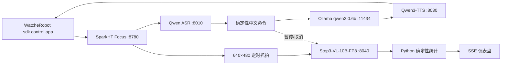

# 看见专注：基于 StepFun 多模态模型的端侧快慢双系统机器人

## 项目目标

在单台 NVIDIA DGX Spark 和 WatcheRobot 上实现中文语音交互与非实时视觉专注趋势统计。快系统面向用户，目标是说完后 4 秒内开始播报；慢系统按时间抓取 640×480 图片，用 Step3-VL-10B-FP8 观察人员、明显手机和杯子变化，只更新仪表盘并在结束时总结。

本次黑客松实现是 SparkHT 独立端侧编排服务，`WatcheRobot_server` 不参与运行。这样避免旧通信协议、产品设备管理和回归范围带来的耦合；正式产品化时再接入主服务生命周期。

## 为什么采用快慢双系统

10B 视觉模型的单批推理以秒计，GPU 进程间又无法可靠硬抢占。若每帧或每轮语音都等待多模态模型，首音目标和交互稳定性无法保证。因此：

- 快系统直接复用本地 Qwen ASR、Ollama 0.6B 和 Qwen3-TTS。
- 慢系统四帧批处理 Step3-VL，保持单并发和最新批次队列。
- 检测到语音后立即停止提交视觉请求并取消当前 HTTP 客户端任务；空闲 5 秒后最多重试一次。
- 开始、查询、停止、取消命令先做确定性匹配，不让 LLM 猜工具。

## 端侧架构



同一个 `watcherobot==0.1.0a4` 对象负责麦克风、相机和 PCM 播放，没有第二条机器人前台应用连接。

## 摄像头约束与视觉边界

摄像头只有 640×480，单张抓拍 API 暖机后约 0.47 秒，不作为视频流使用。系统明确禁止 OCR、身份、情绪、工作内容和屏幕内容识别。模型看不清时必须返回 `uncertain`；杯子变化只能称为疑似事件。

每批最多四图、按时间排序，`temperature=0`、`max_tokens=192`、超时 30 秒。Step3 使用无思维链模板和 vLLM JSON Schema 约束真实 frame ID、字段枚举与顺序，再由 Pydantic 做第二次验证；第一次失败后只做一次 JSON 修复，再失败记录 `analysis_failed`。

## 确定性统计

置信度低于 0.55 或 `uncertain` 不进入对应分母。专注趋势指数由 Python 计算：

```text
100 × (0.7 × 在位率 + 0.3 × (1 - 手机可见率))
```

缺少任一有效分母时返回 `null`，不伪造为 0。手机变化不跨越 uncertain 比较；杯子可见性往返或连续高置信移动只记为疑似事件，并按 20 秒去重。

## 隐私、降级与持久化

图片仅保存在 `runtime/focus/{session_id}`，不上传云端；默认不保存原始麦克风音频。日志不记录配对码、Base64 图片或完整对话。Step3 宕机时快语音继续工作；Ollama 宕机时命令使用固定模板；TTS 宕机时仍在页面显示文本；SDK 断线会把活动会话标为失败。

## 测试与性能

当前 58 项自动测试覆盖聚合器、调度器、提示词解析、中文命令、API/SSE、文件恢复、Step3/ASR/LLM/TTS 协议，以及同一 SDK 连接契约。完整结果与实测数据见 [performance.md](performance.md)。

本机真实 FP8 8040 已完成单图 64-token 结构化输出，以及四图 192-token 三轮基准；四图 P50/P95 为 9.564/11.212 秒。8 帧编排闭环以 9.744/9.874 秒完成两批并持久化 8 个观察。修复置信度提示后，最终两轮 90 秒真机流程在同一网关和 SDK 连接上连续完成：分别得到 9/8 次有效抓拍、各 2 个成功 Step3 批次和各 8 个有效观察；第二轮识别到手机可见率 62.5% 与 3 次状态变化。两轮自动总结首音分别为 1.230/0.887 秒，播放完成后 SDK TCP 连接保持建立。

## 失败案例与下一步

- 8010 健康检查曾为 200，但实际请求因错误覆盖本地模型路径而返回 502；真实 multipart 测试定位并修复。
- Ollama 首次加载超过 4 秒，因此网关启动时主动预热。
- Step3 模型自带 chat template 无条件生成长思维链，192 tokens 内无法稳定留下最终 JSON；改用无思维链模板和服务端 JSON Schema 后，四图 3/3 在 20 秒目标内完成。
- 初版 JSON 骨架把 `confidence` 示例写成 0.0，真实机器人两批输出逐帧照抄，聚合器因此正确拒绝所有样本。修复采用文字占位配合数值 Schema，没有降低统计阈值。
- 连续环境谈话会形成长 ASR 段并反复抢占 Step3；单字噪声现在直接忽略。播放超时会主动停止残留音频，并保留已经观测到的首音时间。
- VAD 能量阈值可通过 `FOCUS_VAD_THRESHOLD` 按现场调节；安静环境默认 500，持续远处谈话的录制现场使用 1500，并要求用户靠近机器人说命令。
- 最新 SDK 通过局域网发现后由机器人自动建立到 SparkHT 的连接；本次实测连接为机器人到 Spark 有线地址，重启网关后无需手工指定机器人 IP。电脑同时连接同网段 Wi-Fi 与有线网络时，服务绑定全部接口，但应以实际 TCP 本地地址确认所用路径。
- 最终两轮的相机 P95 为 0.861/1.277 秒，仍高于 0.7 秒目标。同期对机器人地址的探测出现最高 5% 丢包和 0.893–0.986 秒 RTT 峰值；报告保留所有超时和慢样本，不将局域网抖动包装成模型或 SDK 达标。
- 定时总结曾与持续麦克风监听并发，导致机器人音频 Job 断线。SDK 适配层现在串行播放，外部播报前暂停麦克风，完成后重新打开。
- Python SDK 协议 v1 在每个下行流开始前需要总字节数和 SHA；当前将 TTS PCM 分片作为短顺序流发送，真机必须验证连续性。正式产品版应在 SDK 增加可追加的未知长度流接口。
- 产品化时再接入设备管理、会话权限、集中配置和部署生命周期。
